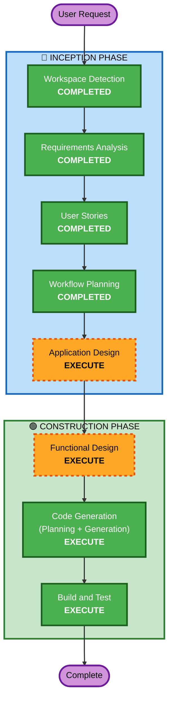

# Execution Plan

## Detailed Analysis Summary

### Change Impact Assessment
- **User-facing changes**: Yes — entire application is user-facing (terminal game)
- **Structural changes**: Yes — new project, new architecture
- **Data model changes**: No — no persistent data
- **API changes**: No — standalone application, no APIs
- **NFR impact**: Yes — real-time rendering performance is critical

### Risk Assessment
- **Risk Level**: Low — greenfield project, no production dependencies, no data at risk
- **Rollback Complexity**: Easy — no deployment, no persistent state
- **Testing Complexity**: Moderate — game logic requires unit tests, rendering needs manual verification

## Workflow Visualization



### Text Alternative
```
Phase 1: INCEPTION
- Workspace Detection (COMPLETED)
- Requirements Analysis (COMPLETED)
- User Stories (COMPLETED)
- Workflow Planning (COMPLETED)
- Application Design (EXECUTE)

Phase 2: CONSTRUCTION
- Functional Design (EXECUTE)
- Code Generation (EXECUTE)
- Build and Test (EXECUTE)
```

## Phases to Execute

### 🔵 INCEPTION PHASE
- [x] Workspace Detection (COMPLETED)
- [x] Requirements Analysis (COMPLETED)
- [x] User Stories (COMPLETED)
- [x] Workflow Planning (COMPLETED)
- [ ] Application Design - EXECUTE
  - **Rationale**: New project needs component identification — game engine, renderer, entity system, input handler. Defines module boundaries before implementation.
- [ ] Units Generation - SKIP
  - **Rationale**: Single deployable unit (one npm package). No multi-service decomposition needed.

### 🟢 CONSTRUCTION PHASE
- [ ] Functional Design - EXECUTE
  - **Rationale**: Game logic has complex business rules — tower targeting, pathfinding, wave progression, damage calculation. Needs detailed design before coding.
- [ ] NFR Requirements - SKIP
  - **Rationale**: NFRs are already captured in requirements.md (performance, compatibility). No additional NFR analysis needed.
- [ ] NFR Design - SKIP
  - **Rationale**: No NFR patterns to incorporate beyond basic game loop optimization.
- [ ] Infrastructure Design - SKIP
  - **Rationale**: No cloud infrastructure — this is a local terminal application.
- [ ] Code Generation - EXECUTE (ALWAYS)
  - **Rationale**: Implementation planning and code generation needed.
- [ ] Build and Test - EXECUTE (ALWAYS)
  - **Rationale**: Build, test, and verification needed.

### 🟡 OPERATIONS PHASE
- [ ] Operations - PLACEHOLDER

## Success Criteria
- **Primary Goal**: Working terminal tower defense game with colored ASCII visuals and vim controls
- **Key Deliverables**: Playable game, npm package structure, unit tests for game logic
- **Quality Gates**: Game runs smoothly at 10+ FPS, all tower/enemy types functional, vim controls responsive
